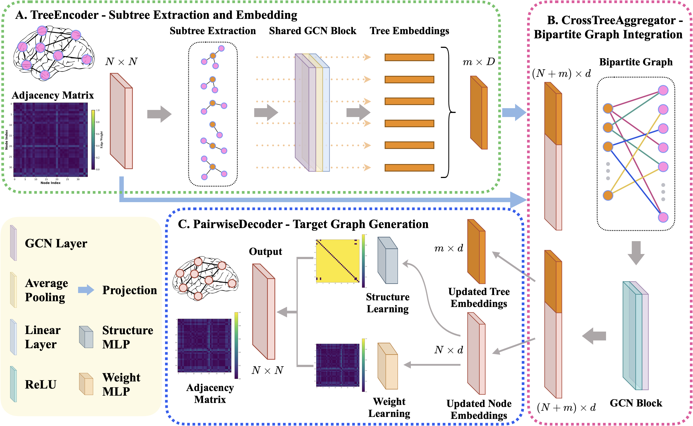

# GTG: Graph-to-Graph Generation Framework

This repository provides the official implementation of our **GraphTreeGen** model and a comprehensive framework for graph-to-graph generation and transformation using multiple state-of-the-art deep learning models.

*Our GraphTreeGen model leverages tree-structured representations to capture hierarchical graph patterns through a novel three-stage architecture: subtree extraction, cross-tree aggregation, and pairwise decoding. This approach enables effective graph-to-graph generation for brain connectivity analysis and other graph transformation tasks.*

## Overview

GTG (Graph-to-Graph) is a research framework that provides implementations of multiple graph generation models for brain connectivity analysis. The framework supports both isomorphic and non-isomorphic graph generation, with applications in brain graph synthesis, super-resolution, and cross-modality mapping.



**Main Contribution**: **GraphTreeGen** - GTG significantly outperforms state-of-the-art baselines in self-supervised task, and remains competitive in supervised settings, delivering higher structural fidelity and more precise edge weights while using far less memory. Its modular, resource-efficient design also lays the groundwork for extensions to connectome super-resolution and cross-modality synthesis.

## Repository Structure

Our GraphTreeGen (TreeGen) implementation is structured as follows:

```
models/TreeGen/                      # GraphTreeGen (Our Proposed Method)
├── __init__.py                      # Package initialization
├── cross_tree_aggregation.py        # Cross-tree aggregation module
├── extract_subtrees.py              # Subtree extraction utilities
├── pairwise_decoder.py              # Pairwise decoding module
├── tree_representation.py           # Tree encoder implementation
├── treegen_dataset.py               # Dataset handling for TreeGen
└── treegen_model.py                 # Main TreeGen model class
```

**Key Components**:
- **`extract_subtrees.py`**: Implements entropy-based and triangle motif-based root selection, k-hop subtree extraction
- **`tree_representation.py`**: Tree encoder using GCN layers with global mean pooling
- **`cross_tree_aggregation.py`**: Bipartite GNN for aggregating subtree information with original graph nodes
- **`pairwise_decoder.py`**: Generates adjacency matrices through pairwise node interactions
- **`treegen_model.py`**: End-to-end model combining all components
- **`treegen_dataset.py`**: Dataset handling and preprocessing for TreeGen

## Models

### 1. GraphTreeGen (Our Proposed Method)
**Location**: `models/TreeGen/`

**GraphTreeGen** is our proposed method for graph-to-graph generation that leverages tree-structured representations to capture hierarchical graph patterns. The model uses a novel three-stage architecture: subtree extraction, cross-tree aggregation, and pairwise decoding.

**Key Features**:
- **Entropy-based Root Selection**: Intelligently selects root nodes for subtree extraction based on local graph entropy
- **Triangle Motif-based Selection**: Alternative root selection using triangle motif centrality
- **k-hop Subtree Extraction**: Extracts local neighborhoods around selected roots using breadth-first search
- **Tree Encoder**: Uses Graph Convolutional Networks (GCN) to encode subtrees into fixed-dimensional representations
- **Cross-Tree Aggregator**: Bipartite GNN that aggregates information between subtrees and original graph nodes
- **Pairwise Decoder**: Generates adjacency matrices using pairwise node interactions with separate structure and weight prediction
- **Super-resolution Support**: Handles non-isomorphic graph generation with different input/output dimensions

**Architecture**:
1. **Subtree Extraction**: Extract k-hop subtrees around carefully selected root nodes
2. **Tree Encoding**: Encode each subtree using GCN layers with global mean pooling
3. **Cross-Tree Aggregation**: Use bipartite GNN to aggregate subtree information with original graph nodes
4. **Pairwise Decoding**: Generate target adjacency matrix through pairwise node interactions

**Training Scripts**: `train_treegen.py`, `train_treegen_cv.py`

### 2. BonsaiGen
**Location**: `models/BonsaiGen/`

A graph generation model that uses exemplar-based learning with Weisfeiler-Lehman (WL) graph representations. The model samples exemplar nodes from source graphs and learns to generate target adjacency matrices.

**Key Features**:
- Exemplar-based graph generation
- WL graph representations
- Support for different decoder types (MLP, GNN)
- Cross-validation training support

**Training Script**: `train_bonsaigen_cv.py`

**Paper**: [Bonsai: Gradient-free Graph Condensation for Node Classification
](https://arxiv.org/abs/2410.17579)

### 3. IMAN GraphNet
**Location**: `models/IMAN_GraphNet/`

Non-isomorphic Inter-modality Graph Alignment and Synthesis for Holistic Brain Mapping. This model handles non-isomorphic graph generation between different modalities (e.g., structural to functional brain graphs).

**Key Features**:
- Non-isomorphic graph generation
- Inter-modality alignment
- Graph Generative Adversarial Network (gGAN)
- Ground Truth-Preserving (GT-P) loss function

**Training Script**: `train_iman.py`

**Paper**: [Non-isomorphic Inter-modality Graph Alignment and Synthesis for Holistic Brain Mapping](https://arxiv.org/abs/2107.06281)

### 4. STP-GSR (Strongly Topology-preserving GNNs for Brain Graph Super-resolution)
**Location**: `models/STP_GSR/`

A model that reformulates edge regression into node regression using dual (line) graph construction to better preserve topology for brain graph super-resolution.

**Key Features**:
- Dual graph construction
- Topology preservation
- Brain graph super-resolution
- Support for multiple graph generation methods (ER, BA, Kronecker, SBM)

**Training Script**: `train_stp_gsr.py`

**Paper**: [Strongly Topology-Preserving GNNs for Brain Graph Super-Resolution](https://link.springer.com/chapter/10.1007/978-3-031-74561-4_11)

### 5. VGAE (Variational Graph Autoencoder)
**Location**: `models/VGAE/`

A variational graph autoencoder implementation for graph generation and reconstruction.

**Key Features**:
- Variational encoding/decoding
- Graph reconstruction
- Latent space learning

**Training Script**: `train_vgae_cv.py`

**Paper**:[Variational Graph Auto-Encoders](https://arxiv.org/abs/1611.07308)

## Installation

### Prerequisites
- Python 3.7+
- PyTorch 1.8+
- PyTorch Geometric
- NetworkX
- NumPy
- Pandas
- Scikit-learn
- Matplotlib

### Setup
```bash
# Clone the repository
git clone https://github.com/basiralab/GTG.git
cd GTG

# For PyTorch Geometric (if not already installed)
pip install torch-geometric
```

## Training and Validation

Our code supports k-fold cross validation for most models. Each model has its own training script with configurable hyperparameters.

### Training GraphTreeGen (Our Proposed Method)

**Cross-Validation Training**:
```bash
python train_treegen_cv.py
```

**Key Configuration Parameters**:
- `node_size`: Number of nodes in the graphs (default: 35)
- `num_roots`: Number of root nodes for subtree extraction (default: 15)
- `k_hop`: k-hop distance for subtree extraction (default: 1)
- `hidden_dim`: Hidden dimension size (default: 32)
- `num_epochs`: Number of training epochs (default: 50)
- `batch_size`: Training batch size (default: 8)
- `learning_rate`: Learning rate (default: 1e-3)

### Training Other Models

1. **BonsaiGen with Cross-Validation**:
```bash
python train_bonsaigen_cv.py
```

2. **IMAN GraphNet**:
```bash
python train_iman_cv.py
```

3. **STP-GSR**:
```bash
python train_stp_gsr_cv.py
```

4. **VGAE with Cross-Validation**:
```bash
python train_vgae_cv.py
```

### What do the training scripts do?

Each training script:
1. Loads source and target graph data
2. Performs k-fold cross-validation (where applicable)
3. Initializes, trains, and validates the model for each fold
4. Stores results under `results/outputs/<model_name>/`:
   - Final trained model checkpoints
   - Training/validation loss curves
   - Evaluation metrics
   - Generated graphs
   - Training logs with memory usage and timing information

## Datasets

### Brain Connectivity Data
- **ASD LH Dataset**: Autism Spectrum Disorder left hemisphere brain connectivity data
- **NC LH Dataset**: Neurotypical control left hemisphere brain connectivity data
- **5-Fold Cross-Validation Datasets**: Pre-split datasets for cross-validation experiments

### Data Format
The framework expects data in the following format:
- Source and target adjacency matrices in CSV format
- 5-fold cross-validation splits in separate directories
- Node features can be generated using different strategies (one-hot, adjacency, degree)

## Adding New Datasets

To use your own dataset:

1. **Prepare your data**: Convert your source and target graphs to adjacency matrices
2. **Create CSV files**: Save adjacency matrices in CSV format
3. **Organize into folds**: Create 5-fold cross-validation splits
4. **Update data paths**: Modify the data loading paths in the training scripts
5. **Adjust parameters**: Update node sizes and other dataset-specific parameters

## Utilities

### Data Processing
- **`utils/load_data.py`**: Load and preprocess graph data from CSV files
- **`utils/build_data.py`**: Generate synthetic datasets for experimentation
- **`utils/MatrixVectorizer.py`**: Convert between matrix and vector representations

## Results

Training results are saved in the `results/outputs/` directory with the following structure:
```
results/outputs/
├── treegen_cv_asd_lh_15/
│   ├── training_metrics.txt
│   ├── fold_1/
│   │   ├── model_checkpoint.pth
│   │   ├── loss_curves.png
│   │   └── evaluation_results.json
│   └── ...
├── bonsai_cv_asd_lh/
└── ...
```

## License

This project is licensed under the MIT License - see the LICENSE file for details.

## Citation

If you use this framework in your research, please cite the relevant papers:

```bibtex

```

## Contact

For questions and support, please contact the maintainers or open an issue on the repository.

